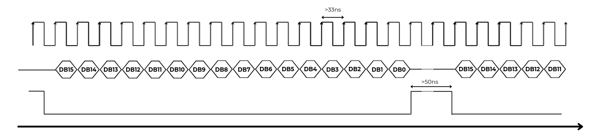
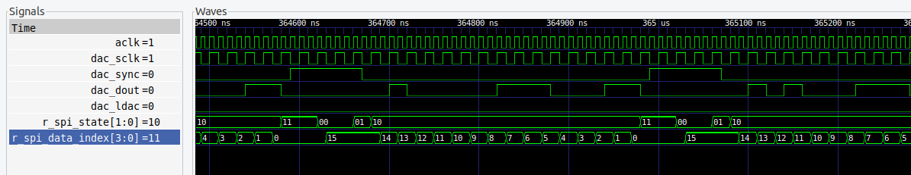

# Driver DAC AD5328

Module to manage the digital to analog converter [AD5328](https://www.analog.com/en/products/ad5328.html) (
[datasheet](https://www.analog.com/media/en/technical-documentation/data-sheets/AD5308_5318_5328.pdf)) from Analog Devices. This converter has 12 bit resolution with external reference. 

This module uses signed inputs. Befor sendig data to the DAC, the module applies an offset of 2048 (`0x7FF`).

This DAC is used in the Platform Board and the OHSim RPHAT.

## Timing diagram



$$Fmax = \frac{1}{(16 \cdot 33e-9+50e-9)}=1.73e6$$

Simulation result 



## Module in/out

### Parameter

|Parameter|Definition|
|-|-|
|`TRANSACTION_DELAY`| Delay between transactions in `aclk` cycles (>50ns) |

### Input

|Input|Definition|
|-|-|
|`aclk`|Clock Input|
|`resetn`|Asynchronous active low reset|
|`ch0_data`| 12-bit signed data input for channel 0|
|`ch1_data`| 12-bit signed data input for channel 1|
|`ch2_data`| 12-bit signed data input for channel 2|
|`ch3_data`| 12-bit signed data input for channel 3|
|`ch4_data`| 12-bit signed data input for channel 4|
|`ch5_data`| 12-bit signed data input for channel 5|
|`ch6_data`| 12-bit signed data input for channel 6|
|`ch7_data`| 12-bit signed data input for channel 7|


### Output

|Output|Definition|
|-|-|
|`dac_dout`|Serial data out|
|`dac_ldac`|Update DAc channels signal|
|`dac_sync`|SPI Sync signal|
|`dac_sclk`|SPI Clock signal. Runs at `aclk` divided by two|

## Instantiation example

```verilog
driver_ad5328 driver_ad5328_inst0 #(
	.TRANSACTION_DELAY(100)
)(
	.aclk(aclk),
	.resetn(resetn),
	/* Analog output channels */
	.ch0_data(ch0_data),
	.ch1_data(ch1_data),
	.ch2_data(ch2_data),
	.ch3_data(ch3_data),
	.ch4_data(ch4_data),
	.ch5_data(ch5_data),
	.ch6_data(ch6_data),
	.ch7_data(ch7_data),
	/* SPI interface */
	.dac_dout(dac_dout),
	.dac_ldac(dac_ldac),
	.dac_sync(dac_sync),
	.dac_sclk(dac_sclk)
);
```